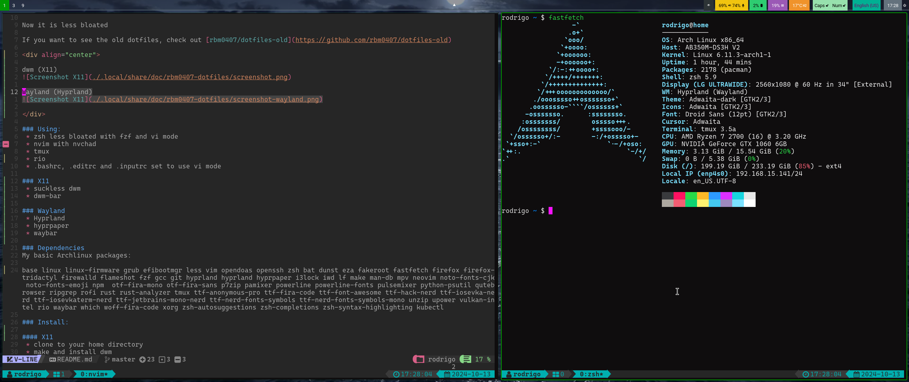
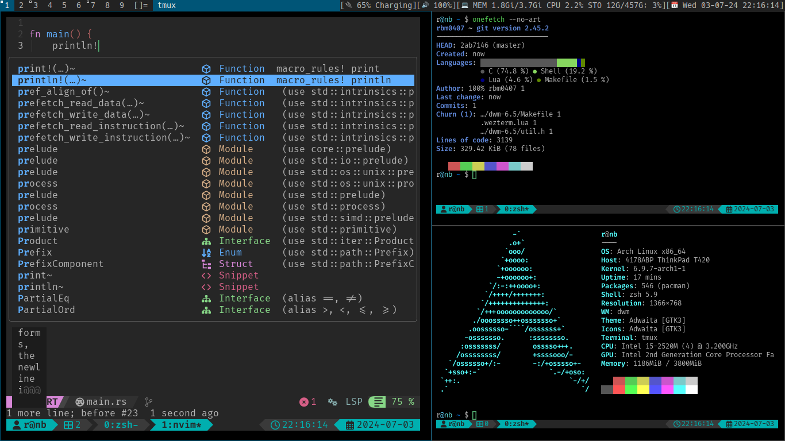

# My dotfiles

Now it is less bloated

If you want to see the old dotfiles, check out [rbm0407/dotfiles-old](https://github.com/rbm0407/dotfiles-old)

<div align="center">

Hyprland (Wayland)


dwm (X11)


</div>

### Using:
 * [zsh](https://man.archlinux.org/man/zsh.1.en) less bloated with [fzf](https://junegunn.github.io/fzf) and vi mode
 * [p10k](https://github.com/romkatv/powerlevel10k)
 * [nvim](https://neovim.io/) with [kickstart](https://github.com/nvim-lua/kickstart.nvim)
 * [tmux](https://github.com/tmux/tmux)
 * [ghostty](https://ghostty.org)
 * .bashrc, .editrc and .inputrc set to use [vi mode](https://wiki.archlinux.org/title/Readline#Editing_mode)
 * [rofi](https://davatorium.github.io/rofi)
 * [dunst](https://dunst-project.org)

### Wayland
 * [Hyprland](https://hyprland.org)
 * [Hyprpaper](https://wiki.hyprland.org/Hypr-Ecosystem/hyprpaper/)
 * [Hyprshot](https://github.com/Gustash/Hyprshot)
 * [Waybar](https://github.com/Alexays/Waybar)

### X11
 * [suckless dwm](https://dwm.suckless.org)

### Dependencies
My basic Archlinux packages:

base linux linux-firmware grub efibootmgr less vim opendoas openssh zsh bat dunst eza fakeroot fastfetch firewalld fd fzf gcc git hyprland hyprlock hyprpaper hyprshot i3lock iwd ghostty grim lf make man-db mpv neovim noto-fonts-cjk noto-fonts-emoji npm otf-cascadia-code otf-fira-mono otf-fira-sans p7zip pamixer powerline powerline-fonts pulsemixer python-psutil qutebrowser ripgrep rofi rust rust-analyzer satty slurp tmux ttf-anonymous-pro ttf-fira-code ttf-font-awesome ttf-hack-nerd ttf-iosevka-nerd ttf-iosevkaterm-nerd ttf-jetbrains-mono-nerd ttf-nerd-fonts-symbols ttf-nerd-fonts-symbols-mono unzip upower vulkan-intel waybar which wl-clipboard woff-fira-code yazi xdg-desktop-portal-hyprland xorg zsh-autosuggestions zsh-completions zsh-syntax-highlighting kubectl

### Install:

#### Wayland
  * add your user to seat group,
  * logout and run `Hyprland`

#### X11
 * clone to your home directory
 * make and install dwm
    ```console
    $ cd ./.local/src/dwm-6.5 && make && doas make install
    ```
 * now you can use it with `startx`

### Optional Packages
See [archlinux-packages.txt](./.local/share/doc/rbm0407-dotfiles/archlinux-full-packages.txt)

### Optional configs:
 * System-wide ctrl:nocaps:
    - create: `/etc/X11/xorg.conf.d/00-keyboard.conf` with contents:
```
Section "InputClass"
    Identifier  "system-keyboard"
    Driver      "kbd"
    Option      "XkbOptions" "ctrl:nocaps"
EndSection
```

### License
[GPL-3.0](LICENSE)
