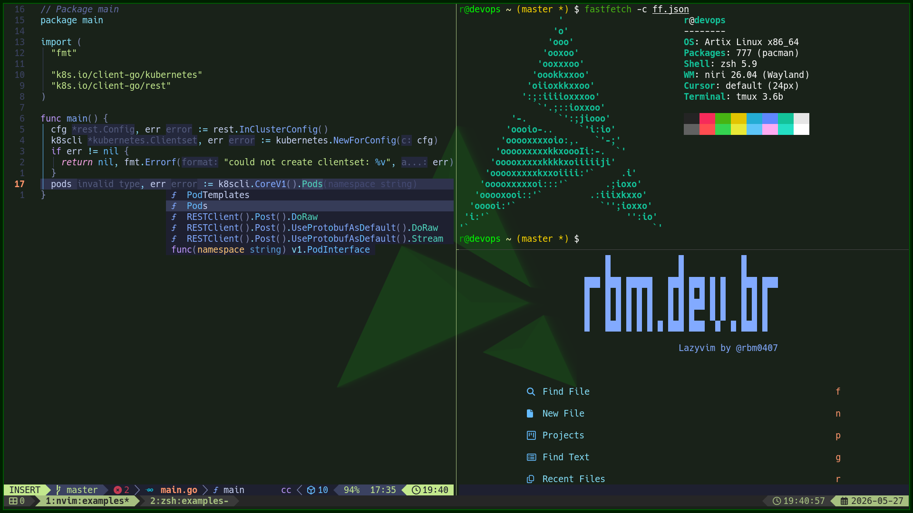

# My dotfiles

If you want to see the old dotfiles, check out [rbm0407/dotfiles-old](https://github.com/rbm0407/dotfiles-old)

## Using

**OS:** [Artix Linux](https://artixlinux.org/)  
**Shell:** [zsh](https://man.archlinux.org/man/zsh.1.en) with vi mode and some aliases  
**Fuzzy finder:** [fzf](https://junegunn.github.io/fzf)  
**Editor:** [nvim](https://neovim.io/) with [lazyvim](https://www.lazyvim.org/)  
**Multiplexer:** [tmux](https://github.com/tmux/tmux)  
**Terminal:** [foot](https://codeberg.org/dnkl/foot)  
**WM:** [Niri](https://github.com/niri-wm/niri)  
**Notification:** [mako](https://github.com/emersion/mako)  
**WM Menu:** [rofi](https://davatorium.github.io/rofi)  
**[Vi mode](https://wiki.archlinux.org/title/Readline#Editing_mode):** .zshrc .bashrc, .editrc and .inputrc set to use vi keybindings  
**Screen lock:** [swaylock](https://github.com/swaywm/swaylock)  
**Wallpaper:** [swaybg](https://github.com/swaywm/swaybg)  
**Container Manager:** [podman](https://podman.io)  
**If need X11:** [suckless dwm](https://dwm.suckless.org)

## Dependencies

[artixlinux-packages.txt](.local/share/doc/rbm0407-dotfiles/artixlinux-packages.txt)

## License

[GPL-2.0](LICENSE)
