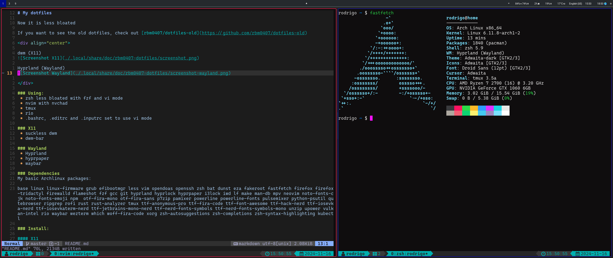

# My dotfiles

Now it is less bloated

If you want to see the old dotfiles, check out [rbm0407/dotfiles-old](https://github.com/rbm0407/dotfiles-old)

<div align="center">

dwm (X11)


Hyprland (Wayland)


</div>

### Using:
 * zsh less bloated with fzf and vi mode
 * nvim with nvchad
 * tmux
 * kitty
 * .bashrc, .editrc and .inputrc set to use vi mode

### X11
 * suckless dwm
 * dwm-bar

### Wayland
 * Hyprland
 * waybar
 * wpaperd

### Dependencies
My basic Archlinux packages:

base linux linux-firmware grub efibootmgr less vim opendoas openssh zsh bat dunst eza fakeroot fastfetch firefox firefox-tridactyl firewalld flameshot fzf gcc git hyprland hyprlock i3lock iwd kitty lf make man-db mpv neovim noto-fonts-cjk noto-fonts-emoji npm otf-cascadia-code otf-fira-mono otf-fira-sans p7zip pamixer powerline powerline-fonts pulsemixer python-psutil qutebrowser ripgrep rofi rust rust-analyzer tmux ttf-anonymous-pro ttf-fira-code ttf-font-awesome ttf-hack-nerd ttf-iosevka-nerd ttf-iosevkaterm-nerd ttf-jetbrains-mono-nerd ttf-nerd-fonts-symbols ttf-nerd-fonts-symbols-mono unzip upower vulkan-intel waybar wezterm which woff-fira-code wpaperd xorg zsh-autosuggestions zsh-completions zsh-syntax-highlighting kubectl

### Install:

#### X11
 * clone to your home directory
 * make and install dwm
    ```console
    $ cd ./.local/src/dwm-6.5 && make && doas make install
    ```
 * now you can use it with `startx`

#### Wayland
  * add your user to seat group,
  * logout and run `Hyprland`

### Optional Packages
See [archlinux-packages.txt](./.local/share/doc/rbm0407-dotfiles/archlinux-full-packages.txt)

### Optional configs:
 * System-wide ctrl:nocaps:
    - create: `/etc/X11/xorg.conf.d/00-keyboard.conf` with contents:
```
Section "InputClass"
    Identifier  "system-keyboard"
    Driver      "kbd"
    Option      "XkbOptions" "ctrl:nocaps"
EndSection
```

### Preferences
* Firefox theme: https://addons.mozilla.org/en-US/firefox/addon/ar51an-dark/

### License
[GPL-3.0](LICENSE)
